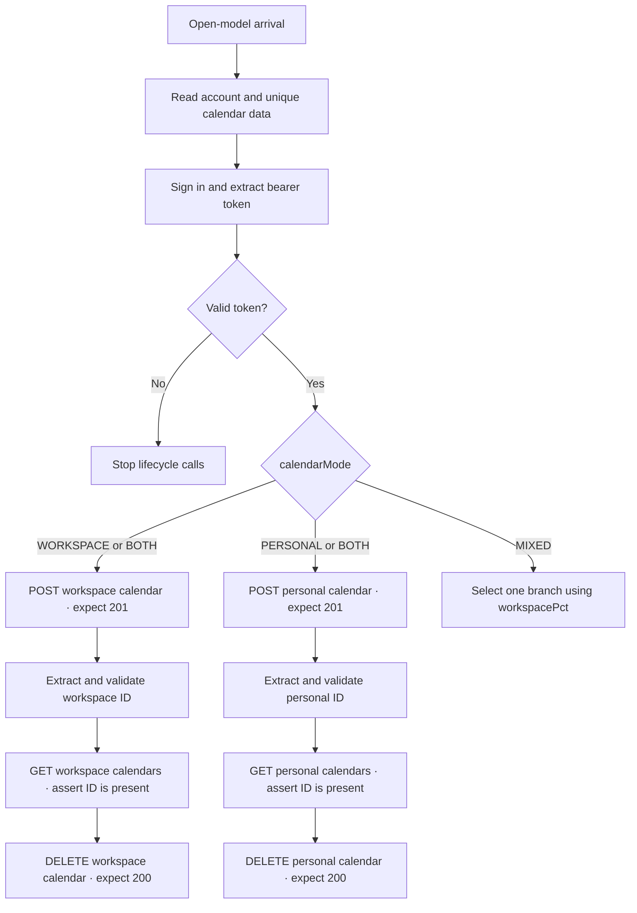

# Resilient Calendar Lifecycle Load Test

An Apache JMeter 5.6.3 open-model API test for authenticated workspace and personal calendar lifecycles, designed without client-side cache dependencies.

> Portfolio sample: all endpoints, credentials, and calendar data are placeholders. No private environment data or production performance results are included.

## What this project demonstrates

This plan models complete business flows instead of isolated endpoint calls. Every arrival authenticates a test account, runs the selected calendar branch or branches, verifies that each created resource is visible through its list endpoint, and finishes with an asserted DELETE request.

- Open-model arrival scheduling rather than a fixed thread count
- Property-driven targets, routes, data files, timeouts, and workload shape
- Workspace and personal `create → verify → delete` lifecycles
- JSON extraction plus HTTP and Groovy assertions
- Authentication isolation and stale-token protection
- Failure-tolerant, ID-guarded cleanup
- Finite, non-recycled scenario data
- No HTTP Cache Manager or browser-only preflight traffic

## Business flow



In `BOTH` mode, workspace is followed by personal within the same business flow. In `MIXED` mode, one branch is selected according to `workspacePct`.

## Reliability decisions

- Per-arrival calendar IDs and bearer state are cleared before authentication.
- Lifecycle calls are guarded by a valid extracted token, so a failed sign-in cannot reuse an earlier identity.
- Verification and cleanup run only when create returned a usable resource ID.
- `continue on error` keeps the final DELETE reachable after a verification assertion fails.
- DELETE is the final sampler in each selected branch and has its own status assertion.
- A zero-arrival cleanup grace period allows in-flight flows to reach deletion.
- Connection and response timeouts prevent stalled requests from accumulating threads indefinitely.
- Calendar data is shared globally, not recycled, and stops a thread at EOF instead of emitting duplicate or `<EOF>` payloads.
- Cookies are cleared between iterations to avoid sharing sessions between test identities.
- UUID-based names reduce collisions between concurrent arrivals.

## Repository layout

```text
jmeter-calendar-lifecycle/
├── README.md
├── calendar-lifecycle-load-test.jmx
└── data/
    ├── calendars.example.csv
    └── users.example.csv
```

The committed CSV files contain synthetic examples only. Keep actual credentials and environment-specific calendar feeds outside version control.

## Configurable properties

| Property | Safe default | Purpose |
|---|---|---|
| `apiHost` | `api.example.invalid` | Target API host; the reserved default prevents accidental traffic |
| `protocol` | `https` | HTTP protocol |
| `apiPort` | `443` | Target API port |
| `signInPath` | `/api/v1/auth/sign-in` | Sign-in endpoint path |
| `workspaceCalendarsPath` | `/api/v1/workspaces/calendars` | Workspace calendar collection path |
| `personalCalendarsPath` | `/api/v1/calendars` | Personal calendar collection path |
| `authTokenJsonPath` | `$.auth_token` | JSONPath used to extract the bearer token |
| `usersCsv` | `data/users.example.csv` | CSV with `email,password` columns |
| `calendarsCsv` | `data/calendars.example.csv` | CSV with workspace/personal names and iCal URLs |
| `loadSchedule` | `rate(1/sec) even_arrivals(10 sec)` | Complete business-flow arrival schedule |
| `cleanupGraceSeconds` | `20` | Period with no new arrivals for in-flight cleanup |
| `calendarMode` | `BOTH` | `BOTH`, `WORKSPACE`, `PERSONAL`, or `MIXED` |
| `workspacePct` | `50` | Workspace share when `calendarMode=MIXED` |
| `connectTimeoutMs` | `10000` | Connection timeout in milliseconds |
| `responseTimeoutMs` | `30000` | Response timeout in milliseconds |

## CSV schemas

`usersCsv`:

```csv
email,password
load.user@example.invalid,not-a-real-password
```

`calendarsCsv`:

```csv
workspaceName,workspaceUrl,personalName,personalUrl
Workspace calendar 01,https://calendar.example.invalid/workspace-01.ics,Personal calendar 01,https://calendar.example.invalid/personal-01.ics
```

Supply at least one unique calendar row for every planned arrival. The users file may recycle dedicated test accounts; the calendar file intentionally does not recycle.

## Run it

Requirements:

- Apache JMeter 5.6.3
- Java 17 or newer recommended
- An authorized non-production API matching the documented request and response contract
- No third-party JMeter plugins

Run from this project directory so the relative sample-data paths resolve correctly:

```bash
mkdir -p results

jmeter -n \
  -t calendar-lifecycle-load-test.jmx \
  -JapiHost=api.test.example \
  -Jprotocol=https \
  -JapiPort=443 \
  -JsignInPath=/api/v1/auth/sign-in \
  -JworkspaceCalendarsPath=/api/v1/workspaces/calendars \
  -JpersonalCalendarsPath=/api/v1/calendars \
  -JusersCsv=data/users.local.csv \
  -JcalendarsCsv=data/calendars.local.csv \
  -JcalendarMode=BOTH \
  '-JloadSchedule=rate(1/sec) even_arrivals(10 sec)' \
  -JcleanupGraceSeconds=20 \
  -l results/smoke.jtl \
  -j results/jmeter.log
```

To schedule approximately 4,000 complete business flows over one hour:

```bash
jmeter -n \
  -t calendar-lifecycle-load-test.jmx \
  -JapiHost=api.test.example \
  -JusersCsv=data/users.local.csv \
  -JcalendarsCsv=data/calendars-4000.local.csv \
  '-JloadSchedule=rate(4000/hour) even_arrivals(1 hour)' \
  -JcleanupGraceSeconds=60 \
  -l results/load-test.jtl \
  -j results/jmeter.log
```

The configured rate represents complete business-flow arrivals, not individual HTTP requests. In `BOTH` mode, one successful flow issues seven HTTP requests: one sign-in request and three requests for each calendar branch.

## Expected API contract

The placeholder plan expects:

- sign-in: HTTP `200` and a token matching `authTokenJsonPath`;
- create: HTTP `201` with the new resource ID at `$.id`;
- list: HTTP `200` with created IDs reachable through `$..id`;
- delete: HTTP `200`.

Adapt paths, request JSON, extractors, and expected status codes when targeting a different API contract.

## Validation evidence

The public artifact is checked as well-formed XML and loaded with Apache JMeter 5.6.3.

A local mock-API run intentionally returned HTTP `500` from workspace verification. The subsequent workspace DELETE still executed and returned `200`. The personal branch completed with create `201`, verification `200`, and delete `200`.

This validates controller and cleanup behavior only. It is not a production capacity benchmark and does not claim live-system throughput or latency.

## Limitations and safety

- Open-model arrival rate is not a fixed concurrent-user count; concurrency emerges from arrival rate and response time.
- Cleanup requires a valid ID from create. If an API creates a resource without returning its ID, the plan cannot address that resource for deletion.
- `Stop Test Now`, process termination, JVM failure, or machine failure can interrupt in-flight DELETE requests. Let the test finish normally and reserve enough cleanup grace time.
- Never run a load test without authorization and an agreed workload envelope.
- Never commit real credentials, bearer tokens, calendar feeds, JTL files, logs, or generated reports. Results may contain request data and authentication material.
- Performance findings are environment-specific; this repository documents test design, not system capacity.
